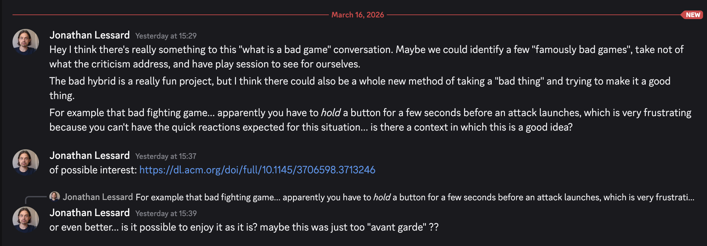

# Conversation

*In which Jonathan and Pippin send version controlled messages to each other about whatever this thing turns out to be?*

## Jonathan (2026-03-16)

### Jonathan Lessard — Yesterday at 15:29
Hey I think there's really something to this "what is a bad game" conversation. Maybe we could identify a few "famously bad games", take not of what the criticism address, and have play session to see for ourselves.

The bad hybrid is a really fun project, but I think there could also be a whole new method of taking a "bad thing" and trying to make it a good thing.

For example that bad fighting game... apparently you have to hold a button for a few seconds before an attack launches, which is very frustrating because you can't have the quick reactions expected for this situation... is there a context in which this is a good idea?

### Jonathan Lessard — Yesterday at 15:37
of possible interest: https://dl.acm.org/doi/full/10.1145/3706598.3713246

### Jonathan Lessard — Yesterday at 15:39
or even better... is it possible to enjoy it as it is? maybe this was just too "avant garde" ??

## Pippin (2026-03-17)

Well, I'm starting a repository like a good proponent of [Materializing Design](https://materializing.design).

We talked last Friday at bowling about a project where we would combine two *bad games* via our hybridization method explored with [Chogue](http://pippinbarr.com/chogue/info) (see forthcoming book chapter etc.) but this time to see whether a hybrid of two bad things would somehow be a "good thing" (or perhaps a worse thing? a mediocre thing? that's the exploration).

While we talked and occasionally looked things up on our phones we realized it was really hard for us to personally identify any actually bad games. We talked a bunch about [Atari's E.T.](https://en.wikipedia.org/wiki/E.T._the_Extra-Terrestrial_\(video_game\)) as emblematically bad, but then kept making cases for how it's kind of good and interesting. Essentially we're often going to be at odds with popular understandings of badness because we've got a tendency to find extreme forms of design or very unusual forms of design alluring because of their ability to surprise?

So then we talked about getting top 10 lists of the worst games for platform x, and in that way found other games to think about. We also talked a bit about making sure our two games would be from different genres. So we could be thinking about "the worst platformer + the worst fighting game" or whatever if we wanted.

We were taken by the idea of a hybrid of E.T. and some fighting game I don't remember the name of that was famously laggy and had terrible controls.

Maybe most importantly, at some point we identified that perhaps what we should do is *try to make a good game* out of the ingredients of the bad games. That our input wouldn't be about decreeing what is bad, but about taking what is popularly seen as bad and seeing if it can "tell a different story"? At least that's my memory of where we got to.

Now we have a repository so it's all totally real.